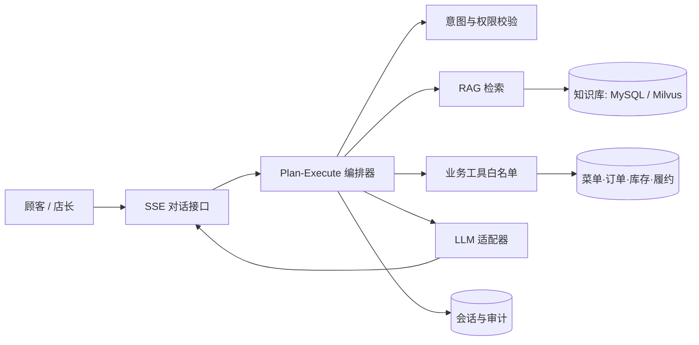

# FIKA 业务 Agent 平台设计

## 目标与边界

将顾客点单 Agent 与店长增长 Agent 收敛到同一套可审计平台：模型负责理解和表达，业务系统负责检索、计算、权限与最终执行。Agent 不能直接创建订单、扣款、发券或改库存；这些动作继续通过已有的计划确认、幂等和服务端结算链路执行。

## 已落地的第一阶段

- `AgentKnowledgeService`：统一知识检索入口，当前使用 MySQL 文档索引作安全降级；结果携带 `source` 与分数，不允许无来源结论。
- `AgentConversationService`：会话以 `USER:id`、`MERCHANT:id` 或 `GUEST:id` 为唯一归属，历史写入 `agent_conversation` 与 `agent_conversation_message`，重连时自动加载最近上下文。
- `BusinessAgentOrchestrator`：固定 Plan-Execute 顺序，执行 `knowledge_retrieve`、`menu_query`，商家身份才可执行 `operation_metrics`。所有工具只读并做身份范围限制。
- `BusinessAgentController`：`POST /api/business-agent/ask` 提供同步结果；`POST /api/business-agent/stream` 返回 SSE 事件：`status`、`plan`、`tools`、`delta`、`done`。前端可逐字渲染 `delta`，并将 `sessionId` 用于下一轮。
- `POST /api/business-agent/knowledge/documents`：仅门店所属商家可写入本店知识文档；当前写入后立即走 MySQL 检索，Milvus 索引任务只做异步增量，不阻塞请求。

### 当前模型实现：GLM 替代 Spring AI Alibaba

当前 `coffee.ai.platform.provider=glm`。GLM 先从工具白名单中选择需要的只读工具，再由后端执行工具并把结果作为证据交给 GLM 生成自然语言回答。模型没有数据库连接、没有支付权限，也不能自行构造 SQL 或业务命令；GLM 限流、超时或输出无效时自动退回规则工具计划。

## Spring AI Alibaba 与 Milvus 的第二阶段适配

当前项目为 Spring Boot 3.2.4 且使用 GLM。为了不破坏订单与支付主链路，建议新增 `coffee.ai.platform.provider=spring-ai-alibaba` 和 `coffee.ai.rag.provider=milvus` 两个开关，并在预发完成兼容测试后启用：

1. 用 Spring AI Alibaba 的 `ChatClient` + Structured Output 生成 `AgentPlan`，而不是让模型直接调用写库接口。
2. 将 `knowledge_retrieve`、`menu_query`、`operation_metrics` 声明为 Function/Tool Bean；工具输入只接收受限 DTO，工具执行与审计仍由应用层管理。
3. 离线把 SOP、营销规则、菜单知识、常见售后问题切分并写入 Milvus；文档元数据至少包含 `tenant/store_id`、`visibility`、`source`、`version`。检索必须附带门店和权限过滤，避免跨店泄露。
4. 采用混合召回（关键词 + 向量）与 rerank；命中不足时回答“未找到依据”，不能补全为事实。
5. 对真实写操作保留“预览 → 用户确认 → 幂等执行 → 审计”四步。Spring AI 的自动工具调用只用于只读工具；发券、改价、下单必须由业务 API 二次确认。

## 数据与并发防御

- SSE 中每个请求捕获启动时的身份快照；会话归属在数据库层二次校验。
- 用户输入限制为 800 字；工具结果限制条数和文本长度，避免提示注入及上下文膨胀。
- 模型超时、429 或不可用时，返回检索/工具事实摘要，绝不阻断点单和支付。
- 订单确认仍使用现有 `Idempotency-Key`；Agent 只产生已签发的方案令牌，不能伪造商品、价格或优惠。
- 后续 Milvus 索引需用异步 Outbox 增量同步，并保留失败重试与版本号，不能在用户请求线程中建立向量。
