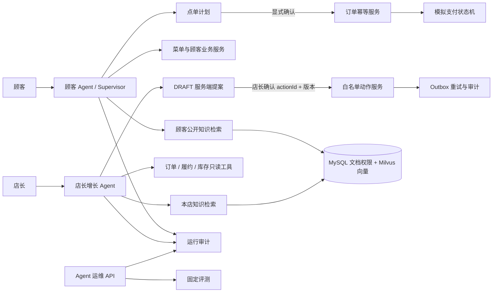

# FIKA 顾客 Agent 与店长 Agent 设计

## 职责边界

产品只保留两个用户可见 Agent。顾客 Supervisor 是顾客 Agent 的统一入口；点单计划服务是它内部的业务步骤，不另算一个对话 Agent。店长增长 Agent 负责经营分析与需审批动作。顾客 Agent 与店长 Agent 不相互委派，也不共享身份或门店数据。

运行观测、固定评测、指标和知识服务属于后端基础能力。`AgentOperationsController` 只提供审计和评测 API，不产生第三套聊天 Agent。原通用 `/business-agent/ask` 与 `/stream` 已删除。

```mermaid
flowchart LR
  U[顾客] --> CA[顾客 Agent / Supervisor]
  CA --> CK[顾客公开知识检索]
  CA --> CM[菜单与顾客业务服务]
  CA --> CP[点单计划]
  CP -->|显式确认| O[订单幂等服务]
  O --> P[模拟支付状态机]

  M[店长] --> MA[店长增长 Agent]
  MA --> MK[本店知识检索]
  MA --> MT[订单 / 履约 / 库存只读工具]
  MA --> D[DRAFT 服务端提案]
  D -->|店长确认 actionId + 版本| X[白名单动作服务]
  X --> OB[Outbox 重试与审计]

  CK --> KB[(MySQL 文档权限 + Milvus 向量)]
  MK --> KB
  CA --> AU[运行审计]
  MA --> AU
  OPS[Agent 运维 API] --> AU
  OPS --> EV[固定评测]
```

## 顾客 Agent

`CustomerSupervisorAgentOrchestrator` 校验身份、门店和会话归属，将咨询/推荐、点单、订单查询和反馈入口路由到已有受控服务。只接受 USER/GUEST；商家与骑手身份拒绝。

点单计划由 `CustomerOrderAgentService` 生成，后端签发短期方案令牌。计划确认后仍使用既有服务端计价、身份校验、库存和 `Idempotency-Key`。支付沿用模拟支付状态机；模型没有创建订单或发起支付的直接权限。SSE 当前只发送真实的处理中提示和最终结果，因为计划服务未暴露细粒度阶段回调。

顾客知识仅允许 `CUSTOMER_PUBLIC`，并在向量候选 MySQL 回查和关键词检索两条路径都校验可见范围、全局/当前门店范围。

## 店长增长 Agent

`MerchantGrowthAgentApplicationService` 读取门店经营快照并生成受策略约束的建议。经营数据查询失败会返回服务不可用，不会降级成零值。

`POST /api/merchant/{merchantId}/growth-agent/analyze` 在服务端持久化 DRAFT，保存分析 ID、版本、哈希和规范化提案正文。确认接口只接受 actionId 和版本，服务端再次核对商户、门店、状态、有效期与提案哈希。执行接口从数据库加载已确认正文，通过动作白名单和 Outbox；客户端不能提交替代提案内容。

店长知识仅限商家所属门店，可以检索公开及内部知识。手工新增默认 `MERCHANT_INTERNAL`，菜单初始化文档为 `CUSTOMER_PUBLIC`。

## 共享运维能力

- `AgentKnowledgeService`：MySQL 保存原文与可见范围，Milvus 只提供向量候选；最终授权以 MySQL 查询为准。
- `AgentRunAuditService`：记录顾客和店长运行轨迹、模型用量及结果。
- `AgentEvaluationService`：对固定样例调用真实顾客路由或店长分析服务；店长评测不保存提案、不执行动作。
- `AgentOperationsController`：提供运行审计与评测，不提供普通问答或业务写操作。
- `AgentBusinessMetricsService`：通过商家增长 Agent 路由暴露本店指标。

## 接口与迁移

顾客入口为 `/api/customer-agent/assistant`，点单为 `/api/customer-agent/plan` 与 `/plans/confirm`。店长接口统一位于 `/api/merchant/{merchantId}/growth-agent/...`。运行和评测接口位于 `/api/agent-operations/...`。

知识可见性及提案确认/有效期字段由 `sql/migrations/V20261001_27_ai_agent_consolidation.sql` 提供。先确认 P1 与 P2 迁移已执行并备份，再由项目负责人手工执行本脚本；本轮不会自动运行数据库迁移。