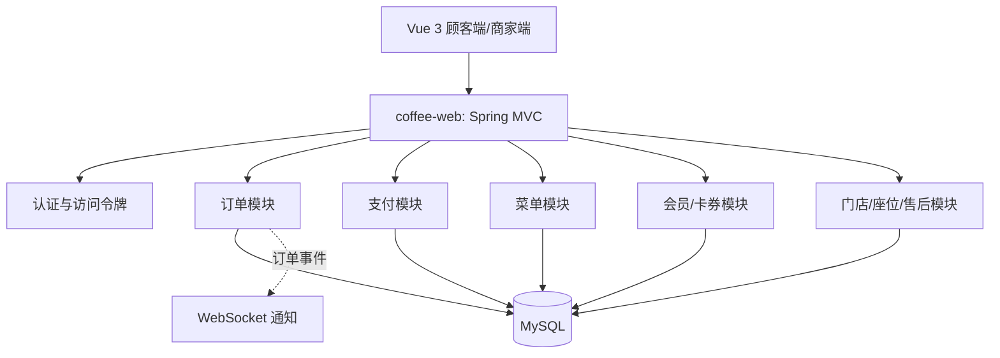
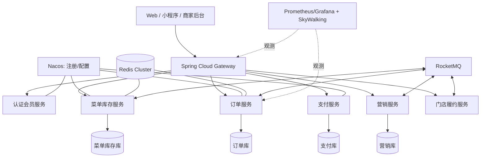
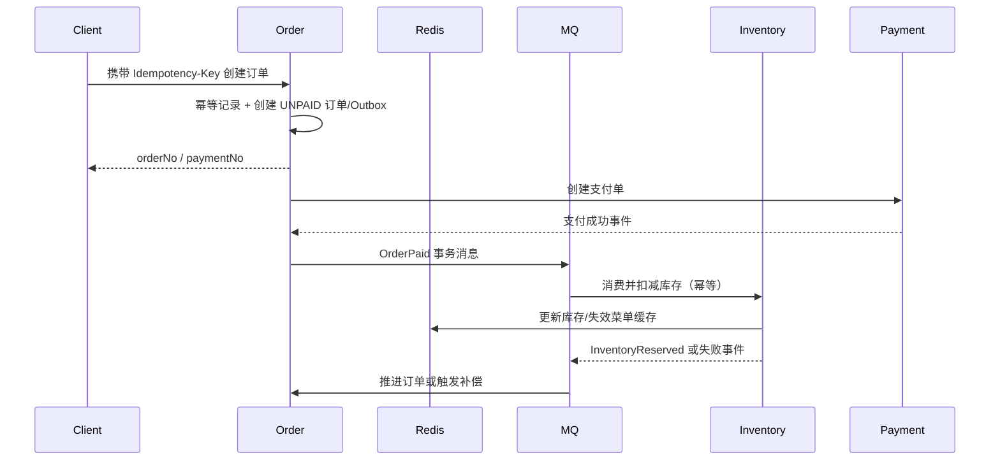

# FIKA 咖啡零售平台｜详细架构设计

> 本文是实施设计与演进路线。`已落地`、`下一阶段`、`后续演进`均明确标记，不把设计目标当作现网事实。

## 1. 架构目标与约束

- 支撑午高峰的热点菜单查询和爆款活动流量，保护订单与数据库。
- 保证订单、支付、库存、卡券、积分等关键链路可追踪、可重试、可恢复。
- 支持多门店数据隔离，后续可独立扩展订单、库存、营销服务。
- 在面试演示环境保持可运行：外部中间件均通过 Docker Compose 或 profile 可选启用。

## 2. 当前架构（已落地）

当前为模块化单体：所有模块同进程部署、同库事务；每个领域模块具有独立 API、领域模型和基础设施层。这是比直接拆微服务更稳妥的起点，但不具备独立弹性扩容与跨服务容错能力。

## 3. 目标架构（后续演进）

### 服务拆分顺序

| 阶段 | 拆分对象 | 原因 | 数据策略 |
|---|---|---|---|
| 1 | 订单服务、库存服务 | 高峰最敏感，扩容诉求明确 | 订单库与库存库独立；事件保证最终一致性 |
| 2 | 营销/会员服务 | 规则变化频繁、活动峰值高 | 卡券与积分独立库，订单消费事件驱动入账 |
| 3 | 支付服务 | 外部渠道隔离、安全边界更清晰 | 独立支付库，回调先落单再异步通知订单 |
| 4 | 门店履约/通知服务 | 适合按城市或门店水平扩容 | 门店维度分区，消息驱动取餐通知 |

## 4. 核心链路设计

### 4.1 下单、扣库存与支付

原则：支付回调必须验签、落库、幂等；MQ 消费者必须以业务唯一键去重；库存不足或消息长期失败需进入死信队列并告警。订单、库存、卡券不采用跨库强事务作为默认方案，优先使用**本地事务 + Outbox + 可靠消息 + 补偿**实现最终一致性；只有确有必要时再评估 Seata TCC。

### 4.2 热点菜单与秒杀

- 菜单按 `storeId:menu:version` 缓存，商品编辑后删除相关键；空值短 TTL 防穿透。
- 价格/库存等高一致性字段不长期依赖缓存；库存预扣采用 Redis Lua 脚本保证“校验 + 扣减”原子性。
- 秒杀入口经过 Gateway/Sentinel 限流，按用户、门店和商品维度限流；超出容量快速失败而不是堆积线程。
- 订单异步创建前记录幂等键，重复点击直接返回原订单结果。

### 4.3 卡券与积分

- 卡券核销使用 `userId + voucherNo + status` 条件更新；数据库唯一约束与应用校验双重保护。
- `OrderCompleted` 事件驱动积分入账和经营指标聚合；消费者保存消费记录，保证至少一次投递下不重复加分。
- 退款/取消发出逆向事件，业务方按原事件或订单号幂等冲正。

## 5. 中间件选型

| 能力 | 建议组件 | 用途 | 状态 |
|---|---|---|---|
| 缓存与分布式锁 | Redis 7 + Redisson | 菜单缓存、热点库存、幂等键、限流 | 下一阶段 |
| 消息队列 | RocketMQ 5 | 订单事件、积分、通知、削峰、死信 | 下一阶段 |
| 服务治理 | Nacos 2 + Spring Cloud Alibaba | 注册发现、配置中心 | 后续演进 |
| 网关与保护 | Spring Cloud Gateway + Sentinel | 鉴权、灰度、限流、熔断 | 后续演进 |
| 搜索 | Elasticsearch | 商品、订单、门店全文检索 | 后续演进 |
| 定时任务 | XXL-JOB | 关单、过期券、补偿扫描、日报 | 后续演进 |
| 可观测性 | Actuator、Micrometer、Prometheus、Grafana、SkyWalking | 健康、指标、告警、链路 | Actuator/Micrometer 本阶段落地 |
| 对象存储 | MinIO / OSS | 商品图、资质、评价图 | 后续演进 |

## 6. 可观测性与安全设计

- 每个 HTTP 请求生成或透传 `X-Request-Id`，写入响应头与日志 MDC，便于跨日志检索。
- 通过 Spring Boot Actuator 暴露 `health`、`info`、`metrics` 等运行指标；生产环境应仅允许内网或监控系统访问。
- Outbox 暴露 `fika.outbox.pending`、`fika.outbox.published`、`fika.outbox.failed` 指标，可由 Prometheus 抓取后在 Grafana 设置积压与失败告警。
- 密码使用 BCrypt；访问令牌由服务端签发并在拦截器中校验，用户、商家、游客身份严格隔离。
- 不提交真实数据库密码、支付密钥或 Token 密钥；使用环境变量与密钥管理服务注入。

## 7. 数据与容灾

- 当前阶段 MySQL 使用唯一索引、事务和迁移脚本保证约束；生产建议主从复制、定期备份与恢复演练。
- 拆分后按服务独立数据库，禁止跨服务直连表；通过 API 或消息事件协作。
- Outbox 表保存待投递事件，定时补偿扫描；死信消息需人工处理入口和可观测告警。

## 8. 实施清单与验收标准

| 优先级 | 事项 | 验收标准 |
|---|---|---|
| P0 | 请求追踪与 Actuator | 响应含 `X-Request-Id`；`/actuator/health` 与 metrics 可用 |
| P0 | 订单请求幂等键 | 已落地：MySQL 唯一键持久化，同一 key 重试返回原响应 |
| P1 | Redis 菜单缓存与缓存失效 | 已落地：菜单/类目/商品/凑单结果缓存；商家改菜单后全量失效相关键 |
| P1 | 库存预扣与防超卖 | 已落地：MySQL 条件更新预扣、待支付取消返还；Redis profile 缓存库存快照。Redis Lua 预扣为秒杀阶段替换点 |
| P1 | Outbox + RocketMQ 订单事件 | 已落地：Outbox CAS 抢占与补偿；`rocketmq` profile 下真实 Producer + 幂等消费者，完成订单积分异步入账 |
| P1 | 库存与秒杀 | 不超卖、限流生效、库存不足可恢复 |
| P2 | Nacos、Gateway、Sentinel | 独立服务可注册、路由、限流与降级 |
| P2 | Prometheus/Grafana/SkyWalking | 订单量、延迟、错误率、Trace 可检索 |

## 9. 面试表达建议

“FIKA 先采用领域边界清晰的模块化单体以控制复杂度。针对午高峰的爆款点单，我将订单和库存作为第一批拆分对象：入口使用网关限流，Redis Lua 原子预扣库存，订单通过 RocketMQ 削峰。支付成功以 Outbox/事务消息发布事件，库存、积分与通知消费者均以业务键幂等处理，最终通过补偿和死信队列保证可恢复。全链路用 Request-Id、Actuator、指标与 Trace 定位问题。”

## 10. Redis 缓存启用方式（已落地）

本地默认使用 Spring 的进程内缓存，并关闭 Redis 健康检查，不依赖 Redis；Docker 环境可执行 `docker compose -f docker-compose.redis.yml up -d`，后端启动时增加 `--spring.profiles.active=redis`。Redis profile 下菜单、类目、商品详情与凑单推荐使用 `fika:` 前缀、10 分钟 TTL，并自动开启 Redis 健康检查；新增或修改商品会失效全部相关菜单键，确保价格和上下架状态及时生效。
