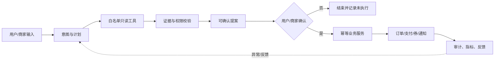
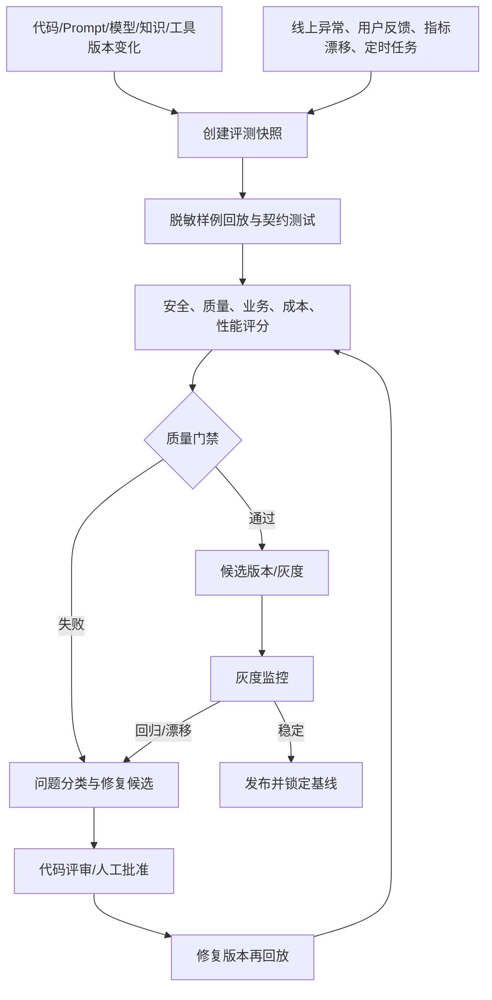
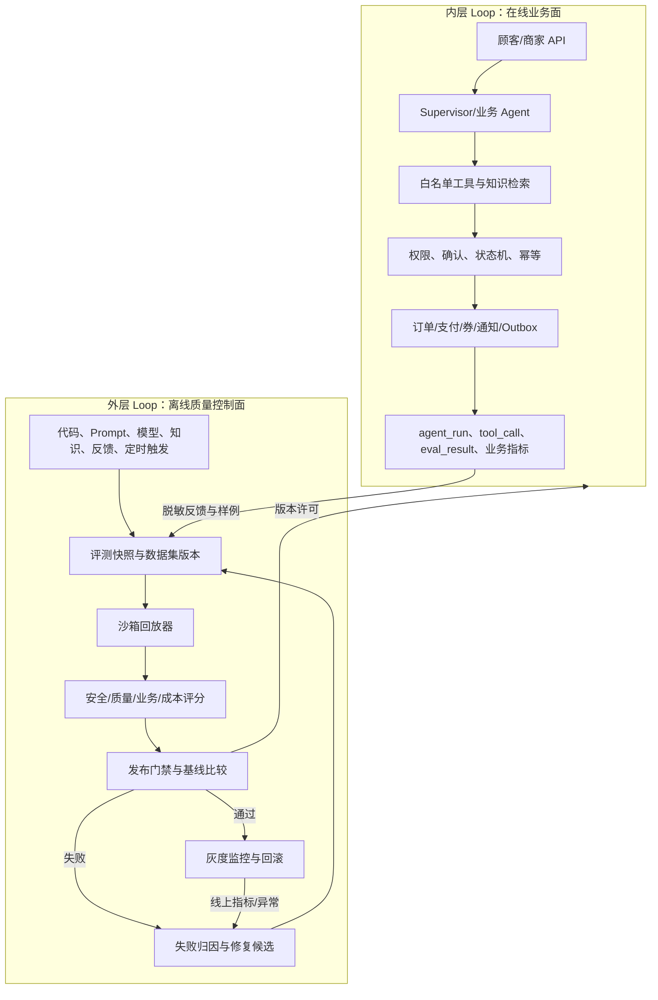

# FIKA 双层 Loop 企业级 AI 应用架构 PRD

> 文档类型：架构与产品设计 PRD  
> 适用项目：`coffee-order`   
> 文档版本：v1.0  
> 编写日期：2026-09-27  
> 状态：设计方案，外层 Loop 尚未实现

## 1. 结论摘要

FIKA 已经具备一条相对完整的 **内层 Loop**：

```text
用户/商家输入
  → 意图识别与结构化计划
  → 白名单工具读取
  → 来源/权限/门店边界校验
  → 方案预览
  → 用户或商家确认
  → 幂等业务执行
  → 订单/支付/券/通知结果
  → Agent 运行审计与业务指标
```

当前代码已经覆盖 HMAC 内部鉴权、AI 限流、Agent 运行轨迹、评测样例、计划确认、订单幂等、Outbox、知识同步重试和商家指标等能力。它适合作为企业级 AI 应用的 **内层业务闭环候选实现**。

但项目还没有完整的 **外层 Loop**。目前缺少一个独立于用户请求的控制平面，用于在 Prompt、模型、工具契约、知识库、代码或配置变化后，自动构造不可变测试快照，批量回放真实或脱敏样例，比较基线，执行安全和业务质量门禁，生成修复建议，再回归验证，并决定是否允许发布、灰度或回滚。

因此当前应这样定位：

| 层次 | 当前判断 | 说明 |
|---|---|---|
| 单次请求内层 Loop | 已形成较强骨架 | 有计划、工具边界、确认、幂等、审计和部分评测 |
| 项目级外层 Loop | 尚未形成 | 没有自动回归编排、版本比较、发布门禁和修复验证控制平面 |
| 企业生产闭环 | 尚未完成 | 迁移、真实中间件、真实模型/支付、E2E、压测和恢复仍需目标环境验收 |

本 PRD 定义的双层 Loop 不允许模型直接修改生产代码、数据库或发布状态。外层 Loop 可以自动发现问题、归因和生成修复候选，但生产修复必须经过代码评审、测试门禁和人工发布审批。

## 2. 双层 Loop 的定义

### 2.1 内层 Loop：业务执行闭环

内层 Loop 的作用是把一次 AI 请求安全地变成一个可验证的业务结果。它关注“这一次请求是否正确完成”。



内层 Loop 的核心不变量：

1. 模型只能理解、规划和表达，不能直接写订单、库存、支付或优惠券。
2. 所有写操作必须通过服务端权限、状态机和幂等键。
3. 一个 `runId` 能还原主体、门店、Prompt/模型/知识/工具版本、工具轨迹、结果和业务影响。
4. 没有可靠证据时返回降级说明，不把模型猜测写成业务事实。
5. 重复请求、重复确认、重复回调和进程重启不能产生重复业务副作用。

### 2.2 外层 Loop：质量与发布控制闭环

外层 Loop 的作用是持续验证系统本身，回答“下一次发布是否比当前版本更安全、更准确、更稳定、更便宜”。



外层 Loop 不等于让 Agent 自主改代码。它是一个受权限、版本、预算、沙箱和人工审批约束的 **质量控制系统**。自动修复只生成补丁、配置变更或问题单；任何变更必须重新进入同一套测试和发布门禁。

## 3. 为什么 FIKA 适合增加外层 Loop

FIKA 已经具备外层 Loop 所需的若干观测接缝：

| 已有能力 | 可作为外层 Loop 的输入 |
|---|---|
| `agent_run` / `agent_tool_call` | 真实运行轨迹、工具选择、耗时、降级和业务结果 |
| `agent_eval_result` | 固定评测样例的断言结果 |
| `agent_cases.jsonl` | 安全、越权、缺货、预算和确认场景 |
| Prompt/模型/知识/工具契约版本 | 回归比较和问题归因维度 |
| 计划确认、订单幂等、Outbox | 业务副作用边界和可重复验证接口 |
| 知识同步重试队列 | 知识版本与检索质量回归触发点 |
| 商家指标接口 | 线上业务结果和成本观测 |

缺失的不是“再写一个 Agent”，而是把这些能力编排成一个独立的版本化、可重放、可判定、可审计的控制面。

## 4. 目标架构



### 4.1 控制面与业务面的隔离

- 外层 Loop 使用独立执行身份、数据库账号和 Redis namespace。
- 评测默认只调用只读工具，禁止创建真实订单、扣款、发券、改库存和发送真实通知。
- 需要验证写链路时，只使用隔离租户、沙箱支付、虚拟门店和可清理数据。
- 评测服务不能通过传入 `storeId` 绕过主体权限；测试样例的身份和门店由服务端绑定。
- 外层 Loop 的发布许可只能由质量门禁服务签发，不能由模型文本决定。

## 5. 外层 Loop 功能需求

### P0：评测快照与可重复回放

每一次外层运行都必须创建不可变 `evaluationRun`，至少绑定：

- 代码提交、构建产物和配置版本；
- Prompt、模型、知识库、工具契约和规则版本；
- 评测数据集及其哈希；
- 执行身份、租户/门店隔离策略、随机种子和时间窗口；
- 运行开始/结束时间、超时、预算和最大样例数。

同一个快照重复执行，应能区分“模型非确定性”与“代码或配置变化”。所有输入应保留脱敏后的摘要，原始用户输入按保留期清理。

### P0：安全与契约门禁

每条样例至少检查：

1. 允许工具集合和禁止工具集合；
2. 跨用户、跨门店、跨角色读取是否被拒绝；
3. 是否正确要求确认，确认前是否产生业务副作用；
4. Prompt Injection、工具参数污染和知识内容注入是否被隔离；
5. HMAC、Nonce、时间戳、请求体摘要和密钥状态是否有效；
6. 订单、支付、券、通知和库存操作的幂等性；
7. 输出是否泄漏 Token、密钥、手机号、邮箱或内部错误堆栈。

任何安全门禁失败都直接阻断发布，不允许用平均分抵消。

### P1：质量和事实性门禁

- 结构化计划可被 JSON Schema、领域规则和库存/价格规则解析；
- 回答中的业务事实有知识文档、菜单数据或工具返回证据；
- 缺货、价格过期、供应商失败和知识库不可用时出现明确降级；
- 计划推荐与用户偏好、预算、门店和时间约束一致；
- 规则降级与模型回答的质量差异可分别统计；
- 用户反馈、订单结果和商家确认结果可以回流为样例标签。

### P1：业务结果门禁

至少建立以下指标并与基线比较：

| 指标 | 说明 | 门禁方式 |
|---|---|---|
| 评测通过率 | 结构、工具、拒答、确认断言全部通过 | 不得低于基线，安全集不得下降 |
| 工具越权率 | 调用 `mustNotCall` 的比例 | 必须为 0 |
| 确认前副作用率 | 未确认就创建订单/券/通知 | 必须为 0 |
| 幂等重复率 | 重放造成重复订单/支付/发券 | 必须为 0 |
| 来源覆盖率 | 可验证事实有来源或工具证据 | 低于阈值阻断 |
| 业务转化率 | 计划采纳、下单、模拟支付完成 | 只作趋势和灰度信号，不能单独替代安全门禁 |
| 单成功订单成本 | 模型费用/成功订单数 | 超预算阻断或降级 |
| P95 延迟 | 从请求到可用回答或计划 | 超 SLO 进入修复队列 |

具体阈值应先以当前版本为基线，再通过评审固化，禁止凭空填写准确率。

### P1：失败归因和修复候选

失败分类必须区分：

- 数据集或断言错误；
- Prompt/模型输出错误；
- 工具选择或参数错误；
- 知识缺失、过期或检索错误；
- 权限/状态机/幂等缺陷；
- 外部依赖超时、错误或限流；
- 性能、成本和资源问题；
- 迁移、配置或部署问题。

修复候选只能输出以下一种或多种工件：

1. Prompt 或规则变更草案；
2. 工具 Schema/权限策略变更草案；
3. 知识补充或重新索引任务；
4. Java 代码补丁草案和对应测试；
5. 数据迁移或配置变更草案；
6. 需要人工处理的缺陷单。

生成修复候选后，必须在相同失败集、全量回归集和安全回归集上重新运行。

### P2：灰度、漂移和回滚

- 通过离线门禁的版本只能进入候选状态；
- 线上先按用户、门店或流量比例灰度；
- 监控失败率、降级率、来源覆盖率、延迟、成本、投诉和副作用；
- 出现安全事件、重复副作用、成本突增或 SLO 连续失败时自动回滚到上一个基线；
- 回滚后保留完整 `evaluationRun`、告警和版本关系，便于复盘。

## 6. 建议数据模型

在现有 Agent 观测表之外，建议增加以下控制面实体：

| 实体 | 关键字段 | 作用 |
|---|---|---|
| `ai_eval_dataset` | `dataset_id`、版本、哈希、场景、脱敏策略 | 固定评测集和变更历史 |
| `ai_eval_run` | `run_id`、基线版本、候选版本、状态、预算、触发源 | 一次完整外层 Loop 运行 |
| `ai_eval_case_result` | `run_id`、`case_id`、断言结果、工具轨迹、分数、错误分类 | 每条样例的可审计结果 |
| `ai_quality_gate` | `run_id`、门禁类型、阈值、实际值、决策 | 发布许可依据 |
| `ai_repair_attempt` | 失败分类、候选补丁、人工审批、重跑结果 | 修复循环和审批链 |
| `ai_release_baseline` | 代码/Prompt/模型/知识/工具版本、指标快照 | 可比较和可回滚基线 |
| `ai_feedback_event` | 用户反馈、订单结果、投诉、标签、脱敏内容 | 将线上结果回流评测集 |

所有控制面表应有租户/环境字段、创建人、时间、幂等键和审计字段。评测原始输入、模型输出和工具结果应按敏感等级加密或脱敏，并设置删除策略。

## 7. 运行状态机

```text
CREATED
  → SNAPSHOT_LOCKED
  → RUNNING
  → SCORING
  → GATED
       ├─ PASSED → CANDIDATE → CANARY → BASELINE
       ├─ FAILED → TRIAGED → REPAIR_PENDING
       │                    ├─ APPROVED → REPLAYING
       │                    └─ REJECTED → CLOSED
       └─ ABORTED
```

规则：

- 同一个 `runId` 不允许重复消费；
- 同一个候选版本和数据集哈希组合只能有一个活动运行；
- 评测超时进入 `ABORTED`，不能被当作通过；
- 门禁服务写入决策后不可静默覆盖，只能追加新的运行或复核记录；
- 修复循环设置最大次数和总预算，超过后转人工。

## 8. FIKA 具体评测集

外层 Loop 第一版应使用已有 `agent_cases.jsonl`，再扩展以下场景：

### 顾客场景

- 菜单查询、过敏原和门店营业时间；
- 商品缺货、价格变化、优惠券不适用；
- 预算约束和多商品点单计划；
- 重复确认、重复支付回调和订单查询；
- 跨门店、跨用户和游客身份越权；
- Prompt Injection 要求模型执行内部工具；
- 知识库不可用、Embedding 延迟和 Redis 不可用；
- SSE 中断后重连不能再次调用模型或重复下单。

### 商家场景

- 复购下降、待制作订单高峰和库存不足；
- 商家只能读取自己的门店指标；
- 提案未确认不得发券或通知；
- Outbox 中途失败后继续消费，已完成顾客不重复处理；
- 模型成本、降级率和来源覆盖率异常；
- 评测接口在生产配置关闭后不可执行写入型评测。

每条样例应显式描述 `expectedTools`、`mustNotCall`、`requiresConfirmation`、`expectedOutcome`、预期证据和允许的降级方式。

## 9. 实施计划

### Phase 0：文档和基线（1 个迭代）

1. 固化代码、Prompt、模型、知识和工具契约版本格式。
2. 将评测集、Schema 和阈值纳入 Git，建立数据集哈希。
3. 从 `agent_run`、`agent_eval_result` 和商家指标导出第一份基线。
4. 明确生产、预发布、评测沙箱三套凭证和数据库边界。

### Phase 1：离线外层 Loop MVP（1—2 个迭代）

1. 增加 `ai_eval_dataset`、`ai_eval_run`、`ai_eval_case_result` 和 `ai_quality_gate`。
2. 实现 `OuterLoopEvaluationJob`、`RegressionReplayService` 和 `QualityGateService`。
3. 只允许只读工具和沙箱写链路，支持按数据集版本重放。
4. 先做手动触发接口，再接入 CI；失败只阻断候选构建，不影响线上运行。

### Phase 2：反馈、归因和修复循环（2—3 个迭代）

1. 接入用户反馈、订单结果、投诉和人工标注。
2. 实现失败分类、相似失败聚合和回归差异报告。
3. 输出 Prompt、知识、规则和 Java 修复候选，但默认只创建待审批工件。
4. 修复候选必须自动生成新增测试或更新评测样例，并重新跑安全集。

### Phase 3：发布门禁和灰度（2—3 个迭代）

1. 将门禁接入 CI/CD，形成“构建 → 单测 → 外层回归 → 镜像 → 部署”的流水线。
2. 接入模型/Prompt/知识版本的灰度路由和指标比较。
3. 实现自动回滚和基线锁定，补齐告警、值班和复盘模板。

### Phase 4：企业运营闭环

1. 组织/租户级权限、配额和成本分摊。
2. 质量、成本、延迟、业务转化和安全事件统一看板。
3. 数据保留、删除、导出、密钥轮换、备份恢复和灾备演练。

## 10. 风险与漏洞清单

### 当前已知风险

1. 数据库迁移和真实 Redis/MySQL/模型/支付联调尚未在目标环境完成，代码通过不能替代部署验收。
2. 生产 profile 已将关键 Agent 审计设置为 fail-closed，数据库不可用时拒绝继续产生无法追踪的运行；开发 profile 仍允许显式降级，必须通过 `auditStatus` 和日志暴露失败计数，不能把开发降级当成生产能力。
3. 当前模型成本存在字符估算，不等于供应商账单；外层 Loop 必须标记估算来源并接入真实用量。
4. 评测集规模有限，无法证明开放世界准确率；必须增加线上脱敏反馈和对抗样例。
5. 当前主要是用户/商家/门店边界，组织、租户、RBAC、管理员审计和配额仍需补齐。
6. 原始 Prompt、工具结果和计划可能包含个人信息、订单信息或内部数据，需要脱敏、加密和保留期。
7. 模拟支付、内存降级和本地评测不能被当成生产支付、集群一致性或真实业务转化证据。
8. 知识文档和工具返回值同样是不可信输入，需要防止间接 Prompt Injection 和错误事实进入执行链路。

### 外层 Loop 新增风险

- 评测任务误调用真实写接口；
- 评测账号越权读取生产数据；
- 自动修复循环无限重试、成本失控或覆盖原始证据；
- 只优化离线分数，导致线上成本、延迟或业务结果变差；
- 数据集泄漏到 Prompt 或模型训练上下文，造成评测污染；
- 灰度回滚只回滚模型，没有同步回滚 Prompt、知识和工具契约。

对应控制措施是独立凭证、沙箱租户、工具权限白名单、预算和最大迭代次数、不可变快照、人工审批、线上反事实监控和完整版本绑定。

## 11. 验收标准

第一版外层 Loop 达到以下条件才可称为“可用”：

1. 任意代码、Prompt、模型、知识或工具版本变化都能触发带哈希的评测运行。
2. 评测运行可重复、可暂停、可恢复、可取消，失败不会被记为通过。
3. 安全集、结构集和业务集均有逐条结果、失败分类和基线差异。
4. 评测账号无法产生真实订单、支付、发券、通知或库存副作用。
5. `mustNotCall`、确认前副作用、重复副作用和跨门店越权门禁为零容忍。
6. 失败可以生成修复候选，修复候选必须经过同一套全量回归和人工审批。
7. 通过版本可以灰度、观测、回滚，并锁定可复现基线。
8. 报告能回答：哪个版本、哪个样例、哪个工具、哪个业务结果失败，修复后是否真正改善。

## 12. 面试中的核心表达

可以把项目表述为：

> 我把 AI 当成受约束的业务执行组件。内层 Loop 负责一次请求从意图、工具、证据、确认到幂等业务结果；外层 Loop 负责在代码、Prompt、模型、知识和工具变化后，对脱敏样例做可重复回放，执行安全、质量、成本和业务门禁，失败后生成修复候选并重新回归，最后通过灰度和回滚控制发布风险。

Java 岗位重点展示：Spring 多模块边界、状态机、幂等、Outbox、任务调度、数据库事务、Redis 一致性、HMAC、线程池与超时、可观测性、测试隔离和 CI 门禁。不要只展示“会调用大模型”，要展示如何让模型在企业业务约束内可恢复、可审计、可发布。

## 13. 当前发布判断

本 PRD 设计完成后，FIKA 的目标架构具备双层 Loop 的清晰边界；但文档本身不代表外层 Loop 已经落地。当前仍应使用“内层业务闭环已实现，外层回归与发布控制面规划完成，正在建设”的表述，完成 Phase 1 和真实环境验收后再升级为“具备双层 Loop 的企业级 AI 应用候选版本”。

## 14. 当前无法在代码仓库内闭合的门禁（红色）

<div style="color:red">

以下项目依赖真实基础设施、供应商账号或组织决策，当前不能仅靠本仓库安全地完成。它们必须在目标环境执行并保留验收证据：

1. **数据库迁移与回滚**：需要一次性测试库执行全部 Agent、P1、P2 迁移，验证旧数据、索引、重复执行和备份恢复。当前本机没有可用的 coffee-order 基线数据库。
2. **真实 MySQL、Redis、RocketMQ、Nacos、Milvus 和 SMTP 联调**：需要部署凭证和网络，仓库测试不能替代多实例、重启、队列积压和故障恢复验证。
3. **真实模型账单核对**：代码已优先读取供应商返回的 usage，仍需要用供应商账单核对 token 和金额字段；字符估算结果只能作为降级观测。
4. **真实支付、退款和对账**：当前保留模拟支付，真实支付需要供应商合同、验签密钥、webhook、退款、对账和合规审批。
5. **组织/租户/RBAC 的最终规则**：需要确认门店、运营、财务、客服和管理员的权限矩阵；代码不能替业务方决定组织模型。
6. **浏览器 E2E、压测、故障注入和灾备演练**：需要目标环境、容量指标、监控和演练窗口；不能用单元测试结果代替。
7. **外层 Loop 的自动修复和发布灰度**：当前已提供评测/验收脚本和 PRD 设计，真正的评测控制面、修复审批、CI 阻断、灰度和回滚服务仍需单独实现。

</div>
