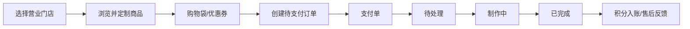

# FIKA 咖啡零售平台｜项目介绍

> 版本：2026-08-09。本文描述**当前已经落地**的功能和工程结构；规划中的分布式能力请以 [架构设计](ARCHITECTURE_DESIGN.md) 的“演进路线”章节为准。

## 1. 项目定位

FIKA 是面向连锁咖啡门店的全链路点单与经营平台。它覆盖顾客从选店、浏览菜单、定制商品、支付、取餐/堂食到售后的完整闭环，也提供商家从入驻、菜单维护、订单制作、座位管理到经营看板的后台能力。

项目不是简单的商品 CRUD：订单、支付、会员、卡券、座位和售后均有明确的领域边界、状态流转和数据一致性规则。当前后端采用 Java 17 + Spring Boot 3 的模块化单体架构，保留了向微服务演进的服务边界。

## 2. 用户与业务场景

| 角色 | 核心目标 | 已实现能力 |
|---|---|---|
| 游客 | 不注册也能快速下单 | 游客会话、店铺与菜单浏览、购物袋、下单、座位占用 |
| 会员 | 更快完成复购并获得权益 | 账号认证、收藏、会员等级、积分、优惠券、订单与售后 |
| 门店商家 | 高效履约并经营门店 | 入驻登录、订单状态流转、菜单/图片/类目、座位、门店设置、看板 |
| 平台运营（规划） | 管理活动与洞察经营数据 | 营销活动、实时运营看板、搜索与推荐 |

## 3. 核心业务闭环

关键约束：

- 未支付订单不会进入商家队列和经营统计；用户仅能取消待支付订单。
- 支付单按订单幂等创建，回调只会将 `UNPAID` 订单推进到 `PENDING` 一次。
- 已完成订单才累计会员消费和积分；取消完成订单会回滚相应权益。
- 卡券采用归属、状态、门槛的条件校验与更新；待支付订单取消后自动返还兑换券。
- 共享菜单使用写时复制：商家编辑共享商品时生成该店专属副本，不影响其他门店。

## 4. 已实现模块

| 模块 | 责任 | 代表能力 |
|---|---|---|
| 认证与身份 | 用户、商家、游客身份隔离 | BCrypt 密码、访问令牌、店铺偏好、游客收藏合并 |
| 菜单 | 商品与分类管理 | 三档规格、定制容量、加料、收藏、共享商品写时复制 |
| 订单 | 交易主流程 | 单品/批量订单、明细分摊、订单号、状态机、门店隔离 |
| 支付 | 支付单与渠道适配 | Mock 支付、渠道策略骨架、幂等回调、待支付隔离 |
| 会员与营销 | 消费权益 | 会员卡、等级折扣、积分、积分兑换券、满减凑单 |
| 座位 | 堂食履约 | 自动分配、二维码落座、超时释放、门店座位图 |
| 售后 | 服务闭环 | 退款/重做/换货申请、商家处理、订单反馈 |
| 门店与商家 | 多店经营 | 一商一店、门店状态、菜单/座位管理、经营看板 |

## 5. 技术栈与工程组织

| 层级 | 当前技术 |
|---|---|
| 前端 | Vue 3、TypeScript、Vite、Pinia、Element Plus、Vue Router |
| 服务端 | Java 17、Spring Boot 3.2、Spring MVC、Spring Scheduler、WebSocket、Actuator、Micrometer |
| 数据 | MySQL 8、MyBatis-Plus、Redis（`redis` profile 可选启用） |
| 安全 | BCrypt、签名访问令牌、请求身份拦截 |
| 工程 | Maven 多模块、DDD 分层、RESTful API、统一异常响应 |

后端模块按领域拆分为 `auth`、`menu`、`order`、`payment`、`membership`、`seat`、`store`、`after-sales` 等模块；模块内部使用 `api / domain / infra` 分层。`coffee-web` 仅负责 HTTP 控制器、Web 配置和应用装配。

## 6. 适合面试讲解的亮点

1. **从模块化单体演进到微服务的边界设计**：先通过领域模块降低耦合，再优先拆订单、库存、营销等变化快、流量高的领域，避免过早分布式化。
2. **订单与支付一致性**：以订单状态机限制非法迁移，以支付单唯一约束和幂等回调防止重复入账。
3. **多门店菜单的写时复制**：共享商品作为默认模板；门店修改时复制为私有数据，实现“统一初始化 + 独立运营”。
4. **会员权益正确性**：积分在完成订单后入账，取消则回滚；优惠券核销及返券对待支付订单形成闭环。
5. **实时履约体验**：WebSocket 用于订单状态/取餐通知，座位通过二维码绑定门店与桌号。
6. **可靠性基础设施**：创建订单要求幂等键并将结果持久化；订单领域事件采用 Transactional Outbox，支持多实例 CAS 抢占、超时恢复和失败重试。
7. **可观测性与性能**：`X-Request-Id` 贯穿请求响应与日志，Actuator 暴露运行指标；菜单缓存默认本地可运行，Redis profile 下可切换为共享缓存。

## 7. 本地运行

1. 创建 MySQL 数据库 `coffee_order_pro`，导入现有结构与种子数据，并按 `sql/migrations/` 的版本顺序执行迁移。
2. 在 `coffee-web/src/main/resources/application.yml` 配置数据源和二维码基础地址。
3. 后端运行：`mvn -pl coffee-web -am spring-boot:run`。
4. 前端进入相邻仓库 `../coffee-order-system-pro_front`，执行 `pnpm install && pnpm dev`。

接口细节见 [API.md](API.md)，存储模型见 [DATABASE.md](DATABASE.md)。

## 8. 基础设施启用说明

- 执行 `sql/migrations/V20260809_02_order_idempotency.sql` 与 `V20260809_03_event_outbox.sql` 后，数据库具备下单幂等与可靠事件表。
- Redis 可执行 `docker compose -f docker-compose.redis.yml up -d` 启动；后端增加 `--spring.profiles.active=redis` 后切换到共享缓存。
- 健康与指标端点：`/actuator/health`、`/actuator/info`、`/actuator/metrics`；Outbox 指标为 `fika.outbox.pending`、`fika.outbox.published`、`fika.outbox.failed`。
